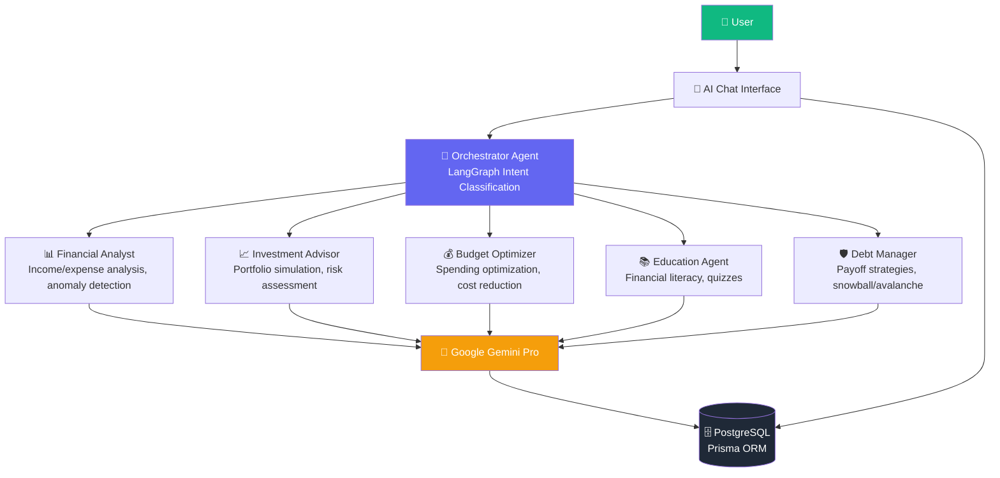

# 🏆 FinanceAI Pro

> **Multi-Agent AI Financial Advisory Platform** — BTK Academy 2026 Hackathon
>
> **5 specialized AI agents** | Google Gemini | LangGraph | Next.js 16 | PostgreSQL

<p align="center">
  
  
  
  
</p>

---

## 🎯 The Problem

**68% of people lack a structured financial plan.** Professional advisors are expensive (₺500-2000/hour), inaccessible, and one-size-fits-all. FinanceAI Pro makes intelligent 24/7 financial guidance free.

---

## 💡 Solution: 5 Expert Agents



---

## ✨ Key Features

### 🤖 Proactive AI Intelligence
- **Daily Briefing** — Personalized AI-generated financial summary every morning
- **Anomaly Detection** — Automated fraud/spike alerts using Gemini analysis of 3-month history
- **Smart Receipt Scanner** — Upload receipt images → Gemini Vision extracts amount, category, description

### 📊 Visual Analytics
- **Financial Health Score** — 0-100 animated gauge (savings rate + debt status + budget adherence)
- **Gamified Badges** — 5 achievements (Tasarruf Ustası, Borç Yokedici, Bütçe Kahramanı, Yatırımcı, Analist)
- **Debt Payoff Visualizer** — Interactive Snowball vs Avalanche chart comparison
- **Live Market Ticker** — USD/TRY, EUR/TRY, BTC/USD, BIST100 scrolling marquee

### 🏢 Enterprise Ready
- **CSV Export** — One-click download of all transactions (UTF-8 BOM, professional format)
- **Print Report** — Beautifully formatted A4 financial summary with `@media print` styles
- **Multi-Agent Chat** — Conversational AI with intent routing across 5 specialist agents

### 🛡️ Security & Architecture
- **Clerk Authentication** — Secure user management with session handling
- **Prisma + PostgreSQL** — Type-safe database with full migration support
- **Docker Ready** — Multi-stage Dockerfile + docker-compose for production deployment

---

## 🏗️ Tech Stack

| Layer | Technology |
|-------|-----------|
| **Frontend** | Next.js 16 (App Router), React 19, TypeScript, Tailwind CSS 4 |
| **AI** | Google Gemini Pro + Gemini 1.5 Flash + Gemini Pro Vision |
| **Orchestration** | LangGraph (intent classification + agent routing) |
| **UI** | shadcn/ui, Radix UI, Chart.js + react-chartjs-2, Framer Motion, Lucide Icons |
| **Database** | PostgreSQL 16 + Prisma ORM (PgBoss adapter) |
| **Auth** | Clerk (SSO, session management, webhooks) |
| **DevOps** | Docker, Docker Compose, Next.js Standalone output |

---

## 🚀 Quick Start

### Prerequisites
- Node.js 20+, PostgreSQL 16+, Google Gemini API key, Clerk account

```bash
# 1. Install dependencies
npm install --legacy-peer-deps

# 2. Configure environment
cp .env.example .env
# Edit .env: DATABASE_URL, GEMINI_API_KEY, Clerk keys

# 3. Setup database
npx prisma generate
npx prisma db push

# 4. Seed demo data (recommended)
npx tsx prisma/seed/index.ts

# 5. Run dev server
npm run dev
```

### Docker
```bash
docker compose up -d
```

---

## 🎮 Demo Walkthrough

| Page | Features | AI Integration |
|------|----------|---------------|
| **`/dashboard`** | Health Score, Badges, Anomaly Alerts, Daily Briefing, Stats Cards, Expense Chart | ✅ Daily Briefing, ✅ Anomaly Detection |
| **`/budget`** | Income/Expense Form, Budget Chart, Receipt Scanner, CSV Export | ✅ Receipt Scanner (Vision), ✅ Budget Optimization |
| **`/invest`** | Market Ticker, Portfolio Simulator, Risk Profiles | ✅ AI-Generated Allocation |
| **`/debt`** | Interactive Snowball/Avalanche Calculator, Payoff Chart | ✅ Strategy Comparison |
| **`/learn`** | Financial Literacy Content | ✅ AI Educational Agent |
| **`/chat`** | Multi-Agent Chat Interface | ✅ 5 Specialized Agents |

---

## 📁 Project Structure

```
financeai-pro/
├── agents/                        # AI Agent implementations
│   ├── orchestrator/              # LangGraph intent routing
│   ├── financial-analyst/         # Analysis + anomaly detection
│   ├── investment-advisor/        # Portfolio simulation
│   ├── budget-optimizer/          # Budget optimization
│   ├── education-agent/           # Financial literacy
│   └── debt-manager/              # Debt payoff strategies
├── app/
│   ├── (dashboard)/               # Main app pages
│   │   ├── dashboard/             # Overview with health score
│   │   ├── budget/                # Budget + receipt scanner
│   │   ├── invest/                # Investment advisor
│   │   ├── debt/                  # Debt management
│   │   ├── learn/                 # Financial education
│   │   └── profile/               # User settings
│   ├── (auth)/                    # Login/Signup
│   └── api/                       # API routes
│       ├── agents/                # Agent endpoints
│       ├── budget/                # Budget CRUD
│       ├── vision/receipt/        # Receipt scanner
│       └── export/transactions/   # CSV export
├── components/                    # React components
│   ├── ui/                        # shadcn/ui primitives
│   ├── charts/                    # Chart.js wrappers
│   ├── agents/                    # Chat interface
│   ├── dashboard/                 # Stats, badges, health gauge
│   └── shared/                    # Sidebar, ticker
├── lib/                           # Utilities
│   ├── gemini.ts                  # Google AI client
│   ├── langgraph.ts               # LangGraph config
│   ├── prisma.ts                  # DB client
│   └── utils.ts                   # Helpers
├── types/                         # TypeScript definitions
└── prisma/seed/                   # Demo data seeder
```

---

## 📊 API Endpoints

| Endpoint | Method | Description |
|----------|--------|-------------|
| `/api/agents/chat` | POST | Multi-agent chat with intent routing |
| `/api/agents/analyze` | POST | Direct agent invocation (analyze, invest, budget, debt) |
| `/api/agents/invest` | POST | Investment portfolio simulation |
| `/api/budget` | GET/POST | Budget data fetching & transaction creation |
| `/api/vision/receipt` | POST | Receipt image parsing (Gemini Vision) |
| `/api/export/transactions` | GET | CSV download of all transactions |

---

## 🔮 Future Roadmap

- **Real-time market data** — WebSocket integration for live prices
- **Mobile app** — React Native companion
- **Multi-language** — English, German, Arabic support
- **Portfolio management** — Automated rebalancing
- **Community** — Expert advisor marketplace

---

## 📄 License

MIT — Built for BTK Academy 2026 Hackathon
